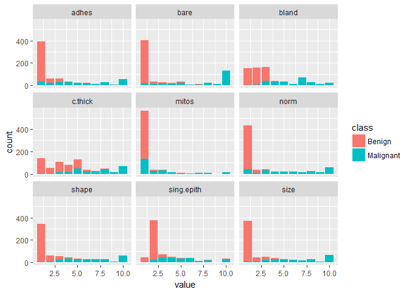
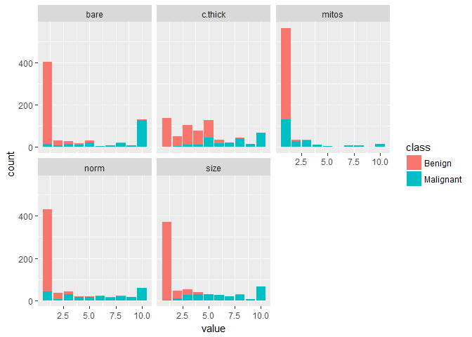

The breast cancer dataset
================
Jose Francisco Endrinal

The breast cancer dataset is a dataset of several tumor examinations. The goal of this dataset was to use the characteristics of these tumors to identify if they were harmless or potentially cancerous. Just as a radiologist (?) would use his or her experience in identifying if these tumors are good or bad, the question of this dataset is: can a machine, with enough examples, do the same as well as or better than a radiologist can?

In this post, I will perform a procedure that will decrease our number of variables (this datasethas nine, which would be extremely difficult to visualize). And we will be using an algorithm called logistic regression.

Let’s begin:

``` r
suppressPackageStartupMessages({
  library(tidyverse)
  library(knitr)
  library(stats)
  library(modelr)
  library(gganimate)
  library(animation)})
# Load dataset, rename variables
read_csv("data/breastcancer.csv") %>% 
  filter(X7 != "?") %>% 
  rename(code = X1, 
         c.thick = X2, 
         size = X3,  
         shape = X4, 
         adhes = X5, 
         sing.epith = X6, 
         bare = X7, 
         bland = X8, 
         norm = X9, 
         mitos = X10, 
         class = X11) %>% 
  mutate(
    # change label to 0 or 1
    class = recode(class, `2` = 0, `4` = 1), 
    bare = as.integer(bare), 
    class = as.integer(class)) %>% 
  # remove the id number
  select(-code) -> breastcancer
```

    ## Parsed with column specification:
    ## cols(
    ##   X1 = col_integer(),
    ##   X2 = col_integer(),
    ##   X3 = col_integer(),
    ##   X4 = col_integer(),
    ##   X5 = col_integer(),
    ##   X6 = col_integer(),
    ##   X7 = col_character(),
    ##   X8 = col_integer(),
    ##   X9 = col_integer(),
    ##   X10 = col_integer(),
    ##   X11 = col_integer()
    ## )

Let’s take a look at what this dataset looks like:

``` r
breastcancer
```

    ## # A tibble: 683 x 10
    ##    c.thick  size shape adhes sing.epith  bare bland  norm mitos class
    ##      <int> <int> <int> <int>      <int> <int> <int> <int> <int> <int>
    ##  1       5     1     1     1          2     1     3     1     1     0
    ##  2       5     4     4     5          7    10     3     2     1     0
    ##  3       3     1     1     1          2     2     3     1     1     0
    ##  4       6     8     8     1          3     4     3     7     1     0
    ##  5       4     1     1     3          2     1     3     1     1     0
    ##  6       8    10    10     8          7    10     9     7     1     1
    ##  7       1     1     1     1          2    10     3     1     1     0
    ##  8       2     1     2     1          2     1     3     1     1     0
    ##  9       2     1     1     1          2     1     1     1     5     0
    ## 10       4     2     1     1          2     1     2     1     1     0
    ## # ... with 673 more rows

Our y variable (class) is represented by a 1 or 0 in this dataset. The rest of the variables represent different characteristics of the tumors in question. All of these features represent a ranking from 1 to 10 of the relative magnitudes (largenesses or smallnesses) of each variable. We have a few problems with this dataset:

1.  Since these measurements are not exactly direct measurements of the tumors, our data is strictly stuck between 1 or 10. This isn’t like ratio or interval data, this dataset behaves like ordinal data. What this means is that instead of having the data having an absolute zero (like height), or having it range freely from negative to positive values, or having decimal values, we’re stuck with positive integers {1, 2, 3, …, 10} and that’s it.

2.  We have nine variables here, which means that it might become harder to predict our class. Some variables will not help us in making these predictions, and so we might need to eliminate them.

3.  Having nine variables here makes it so much harder to visualize. We can’t do the Petal.length and Petal.width scatterplot graph I did in my previous post. And no, a boxplot visualization will not help, since as mentioned before, our dataset behaves ordinally.

4.  The variable bare has dirty data that needs cleaning. We already filtered that in the previous code. I feel like a whole other post should be dedicated to data cleaning.

Exploratory Data Analysis
=========================

Let’s take a look at what these variables look like. We can’t use a boxplot to show this, since this isn’t continuous, it might be wise to plot a bar graph with different facets for this visualization.

Let’s see what that looks like for each class:

``` r
gather(breastcancer, key, value, -class) %>% 
    mutate(class = recode(class, 
                          `1` = 'Malignant', 
                          `0` = 'Benign') %>% as.character()) %>% 
  ggplot(aes(x = value)) + 
  geom_bar(aes(fill = class)) + 
  facet_wrap(~ key, nrow = 3, ncol = 3)
```

 Before we take a step further, we have to make clear what we want in this visualization. Personally, from here, I want to find a way to decrease the number of variables we can work with so we can visualize their relationship in easy charts. Decreasing the number of variables (or dimensionality reduction) is normally done with more variables than now, but it would be wise for the reader to know that this exists.

The variables we want would show that as you increase the value of our variable, benign cases decrese (increase) and malignant cases increase (decrease). And we want to show that this relationship is smooth all the way, that for every decrease in one class, there seems to be an increase in another class.

Looking at the charts above, we’ll want to remove sing.epith, mitos, bland, and adhes, but before we exclude that from our model right away, we have to use a process that makes this more deliberate.

We’ll be finding linear combinations that maximize the variance of the predicted value. From there, we will We’re going to perform Principal Component Analysis (PCA).

``` r
breastcancer.n <- breastcancer %>% 
  mutate_if(is.integer, scale)
pca <- prcomp(~ adhes + 
                bare + 
                bland + 
                c.thick + 
                mitos + 
                norm + 
                shape + 
                sing.epith + 
                size, 
              data = breastcancer.n)
pca$rotation
```

    ##                  PC1         PC2          PC3         PC4         PC5
    ## adhes      0.3327236 -0.05209438  0.412647341 -0.49317257  0.01956898
    ## bare       0.3350675 -0.26126062 -0.000691478 -0.49861767  0.12477294
    ## bland      0.3457474 -0.22807676  0.213071845 -0.01304734 -0.22766572
    ## c.thick    0.3020626 -0.14080053 -0.866372452 -0.10782844 -0.08032124
    ## mitos      0.2302064  0.90555729 -0.080492170 -0.25898781 -0.10504168
    ## norm       0.3355914  0.03396582  0.134248356  0.41711347 -0.69021015
    ## shape      0.3775825 -0.08242247 -0.033510871  0.17586560  0.10839155
    ## sing.epith 0.3362340  0.16440439  0.087742529  0.42738358  0.63669325
    ## size       0.3807930 -0.04664031  0.019937801  0.20425540  0.14565287
    ##                    PC6          PC7         PC8          PC9
    ## adhes      -0.65462877  0.123830400 -0.16343403 -0.046019211
    ## bare        0.60922054  0.402790095  0.12665288  0.076510293
    ## bland       0.29889733 -0.700417365 -0.38371888 -0.062241047
    ## c.thick    -0.24251752 -0.008515668 -0.24770729  0.002747438
    ## mitos       0.14834515 -0.132116994  0.05353693 -0.007496101
    ## norm        0.02151820  0.459782742 -0.07401187  0.022078692
    ## shape      -0.07452713 -0.127209198  0.58272674 -0.667480798
    ## sing.epith  0.06930891  0.211018210 -0.45866910 -0.066890623
    ## size       -0.13903168 -0.205434260  0.43629981  0.733210938

Because I have the benefit of this being a really rough way to work with our data. What I’ll be doing is that I’ll be picking out the variables that show the highest coefficients in any of the components. I’ll be picking out five. Here are the variables we will be using: mitos, c.thick, norm, bare, size

Let’s zoom in these variables:

``` r
select(breastcancer, mitos, c.thick, norm, bare, size, class) %>% 
  gather(key, value, -class) %>% 
  mutate(class = recode(class, 
                        `1` = 'Malignant', 
                        `0` = 'Benign') %>% as.character()) %>% 
  ggplot(aes(value)) + 
  geom_bar(aes(fill = class)) + 
  facet_wrap(~ key, nrow = 2, ncol = 3)
```

 All the variables except for mitos have a clear trade-off: As you increase the value, you will give up class ‘0’ for class ‘1’.

Let’s try making mitos interact with the other variables:

``` r
select(breastcancer, mitos, c.thick, norm, bare, size) %>% 
  gather(key, value, -mitos) %>% 
  filter(value != 1 & mitos != 1) %>% 
  group_by(key, mitos, value) %>% 
  mutate(count = n()) %>% 
  ggplot(aes(x = mitos, y = value)) + 
  geom_tile(aes(fill = count)) + 
  facet_wrap(~ key, nrow = 2, ncol = 2)
```


Train, Test Sets
================

A friend of mine recommended that I make a data frame of multiple training and test sets, run my model through all of them and get the average of the result. In my previous post, I made one training and testing split, but now here, we will be making 100 pairs of splits.

We’ll be dividing our dataset into 70% of the observations for the train set and 30% of the observations as the test set.

``` r
set.seed(2387)
# create dataframe of train, test sets
tt.sets <- select(breastcancer, bare, c.thick, norm, size, class) %>% 
  crossv_mc(n = 100, test = 0.3) %>% 
  mutate(ind.tr = map(train, as.integer), 
         ind.te = map(test, as.integer), 
         train.s = map(train, as_data_frame), 
         test.s = map(test, as_data_frame))
tt.sets
```

    ## # A tibble: 100 x 7
    ##             train           test   .id      ind.tr      ind.te
    ##            <list>         <list> <chr>      <list>      <list>
    ##  1 <S3: resample> <S3: resample>   001 <int [478]> <int [205]>
    ##  2 <S3: resample> <S3: resample>   002 <int [478]> <int [205]>
    ##  3 <S3: resample> <S3: resample>   003 <int [478]> <int [205]>
    ##  4 <S3: resample> <S3: resample>   004 <int [478]> <int [205]>
    ##  5 <S3: resample> <S3: resample>   005 <int [478]> <int [205]>
    ##  6 <S3: resample> <S3: resample>   006 <int [478]> <int [205]>
    ##  7 <S3: resample> <S3: resample>   007 <int [478]> <int [205]>
    ##  8 <S3: resample> <S3: resample>   008 <int [478]> <int [205]>
    ##  9 <S3: resample> <S3: resample>   009 <int [478]> <int [205]>
    ## 10 <S3: resample> <S3: resample>   010 <int [478]> <int [205]>
    ## # ... with 90 more rows, and 2 more variables: train.s <list>,
    ## #   test.s <list>

So how will we visualize these training and test sets? All I really want to show is that these sets are really representative samples of the whole dataset. Since we have multiple training and test splits, we will be trying to make a gif using gganimate.

``` r
select(tt.sets, ind.tr, ind.te, .id) %>% 
  gather(key = "set", value = "value", ind.tr, ind.te, -.id) %>%
  unnest() %>% 
  arrange(by = .id, value) %>% 
  filter(.id %in% c("001", 
                    "002", 
                    "003", 
                    "004", 
                    "005", 
                    "006", 
                    "007")) %>% 
  group_by(.id) %>% 
  mutate(
    x.grid = rep(1:30, length = n()), 
    y.grid = rep(rev(1:28), each = 30, length = n()), 
    set = recode(set, 
                 "ind.tr" = "Train", 
                 "ind.te" = "Test")) %>% 
  ggplot(aes(x.grid, y.grid, frame = .id, color = set)) + 
  geom_text(aes(label = value), size = 3) -> sets.gg
gganimate(sets.gg)
```

<video controls loop>
<source src="breastcancer_post1_files/figure-markdown_github/unnamed-chunk-9.webm" />
</video>
As you can see in the animation above, the red and blue text is randomly picked from whe whole dataset, which means that these train and test sets are randomly picked. This is important for us when coming up with a score for the model. We want to know if this will work well for more than just one test set.

Logistical Regression
=====================

Logistic regression is a model fit for analyzing how input variables relate to the outcomes of success (1) or failure (0). The input variables don’t have to also be dummy variables (1 or 0), and can be counted variables or measured variables.

Logistical regression looks very similar to linear regression -- y = B0 + B1\*X in the sense that the form is very similar. In fact, you could be just fine doing good old linear regression. The problem is that if you draw a straight line in the middle of your observations, your predictions might not always between 1 or 0 -- a big problem, because your values are only 1 or 0.

With the splits of train and test all ready, we can apply logistic regression on the training and test sets.

We implement the logistic regression algorithm with the following code:

``` r
# lgit model implementation
lgit <- function(df){
  glm(class ~ ., family = binomial(link="logit"), data = df)}
```

In order to test the performance of our model, we will predict values from the test set using the function lgit\_predict. To extract out real y variable from each test set, we will use the function lgit\_response.

``` r
# predict test set
lgit_predict <- function(model, df){
  preds <- predict(model, newdata = select(df, -class), type = "response")
  if_else(preds > 0.5, 1, 0)}
# extract y values from test set
lgit_response <- function(df){
  df[["class"]]}
```

The predictions of logistical regression are not 1 or 0 but values in between. In order to create predicted values, we simply divide our predictions between those less than 0.5 and those greater than 0.5.

Using the function lgit\_mscore, we score how well the algorithm made the right predictions for each train and test split. We will be using the map function to apply all these functions to our nested training and test sets.

``` r
# average score
lgit_mscore <- function(pred, resp){
  df <- pred == resp
  mean(df)}
# create new variables
tt.sets <- tt.sets %>% 
  mutate(model = map(train.s, lgit), 
         pred = map2(model, test.s, lgit_predict), 
         resp = map(test.s, lgit_response), 
         hit = map2_dbl(pred, resp, lgit_mscore))
score <- summarise(tt.sets, score = mean(hit))
score[[1]]
```

    ## [1] 0.9653171

Fortunately for us, you can actually view what this model looks like. We can check out the marginal effects of our four chosen variables and we can do it for each training and test set. But that’s a blog post for another time.

------------------------------------------------------------------------

More dataset information: [UCI](https://archive.ics.uci.edu/ml/machine-learning-databases/breast-cancer-wisconsin/breast-cancer-wisconsin.names)

Feedback:
Email: <francis.endrinal@gmail.com>
FB Messenger: m.me/transparencyman
Twitter, Instagram: @jgendrinal
