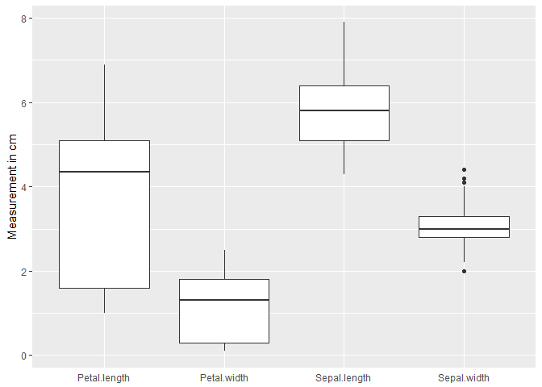
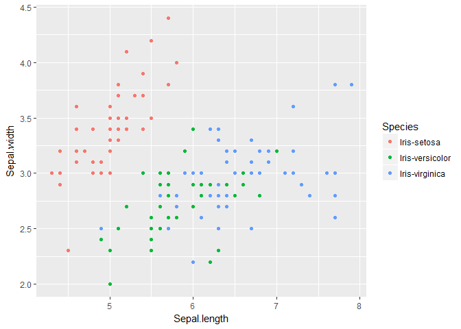
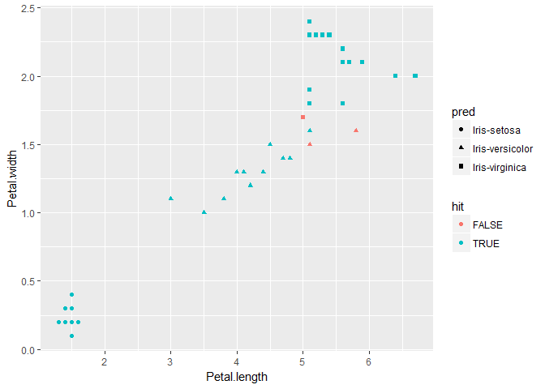
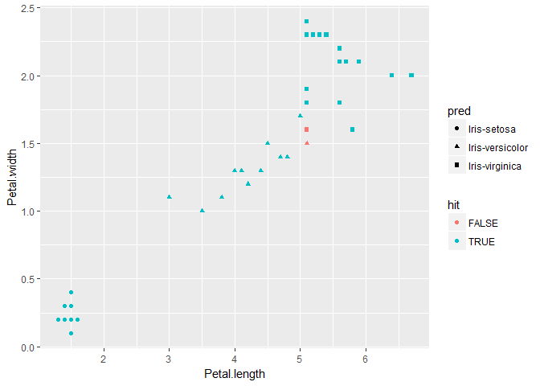

Exploring the Iris Dataset
==========================

One of the most common datasets that I came across in my journey into the data science world is called Iris. The dataset is a record of feature measurements (petal lengths and widths, sepal lengths and widths) of different species of Iris flowers. It is often used to demonstrate simple machine learning techniques.

Many versions of this dataset exist, but we will be using the data found [here](https://archive.ics.uci.edu/ml/machine-learning-databases/iris/iris.data).

In this piece I'll be tearing this dataset apart and will perform simple machine learning.

*Now, I'm not an expert in data science or a data analyst (not yet). So I don't intend to do all the algorithm code from scratch. Instead, I will borrow tools that have alredy been made by others.*

I'll be using [R](https://cran.r-project.org/) to write out how each algorithm, visualization, and data transformation was made. The R language is a programming language used for statistical analysis. It was initially very clunky and difficult to understand, because it wasn't really made for clean code. Fortunately for us, the workflow in R became much easier to use when Hadley Wickam made a package (set of handy functions and tools for R programming) called [*tidyverse*](https://www.tidyverse.org/). Tidyverse creates a very beautiful space for people to do their analysis on R.

This post was created on R Notebooks, which makes it easier for me to type out a document and program within that document at the same time.

Okay, let's take a look at a piece of the dataset, but before that we have to do two things before anything else: 1) Load all necessary packages 2) Import our dataset

``` r
suppressPackageStartupMessages({
  library(tidyverse)
  library(modelr) # for train, test split
  library(knitr) # for github markdown
  library(rpart) # decision trees
  library(rpart.plot) # plotting decision trees
  library(class) # for k-Nearest Neighbors classification
  library(e1071)}) # for support vector classification
# Variable names not specified in dataset, rename
read_csv("data/iris.csv") %>% 
  rename(Sepal.length = X1, 
         Sepal.width = X2, 
         Petal.length = X3, 
         Petal.width = X4, 
         Species = X5) %>% 
  as_tibble() -> iris
```

With the dataset now saved to iris, we can now take an initial look at it.

    ## # A tibble: 150 × 5
    ##    Sepal.length Sepal.width Petal.length Petal.width     Species
    ##           <dbl>       <dbl>        <dbl>       <dbl>       <chr>
    ## 1           5.1         3.5          1.4         0.2 Iris-setosa
    ## 2           4.9         3.0          1.4         0.2 Iris-setosa
    ## 3           4.7         3.2          1.3         0.2 Iris-setosa
    ## 4           4.6         3.1          1.5         0.2 Iris-setosa
    ## 5           5.0         3.6          1.4         0.2 Iris-setosa
    ## 6           5.4         3.9          1.7         0.4 Iris-setosa
    ## 7           4.6         3.4          1.4         0.3 Iris-setosa
    ## 8           5.0         3.4          1.5         0.2 Iris-setosa
    ## 9           4.4         2.9          1.4         0.2 Iris-setosa
    ## 10          4.9         3.1          1.5         0.1 Iris-setosa
    ## # ... with 140 more rows

There are five columns in this dataset with the following variable names: Sepal.length, Sepal.width, Petal.length, Petal.width, and Species.

The first four variables are real measurements made in centimeters. All of the specimens of Iris (irises or iri?) were taken from the same location, measured by the same person, and with the same instrument to measure.

But what are these measurements? And why are these parts of the flower so important?

It turns out that this dataset was used to try to make a computer predict which specimens (in rows) belonged to each species of Iris flower. This sort of problem was up in the air in the time before genetics was used to classify animals. At the time, scientists depended on what these species looked like in order to make the distinctions (on why this is wrong [here](http://www.iapt-taxon.org/historic/Congress/IBC_1959/Prop018-019.pdf)).

This data was used in 1936 by Ronald A. Fisher to determine if you can identify species of Iris flower just by measuring the lengths and widths of sepals and petals. He published his results [here](http://rcs.chemometrics.ru/Tutorials/classification/Fisher.pdf).

And just so the reader understands what exactly the petals and the sepals of a flower are, we have a very helpful image labeling the parts of the flower:


Here's a rough and simple-worded way of differentiating them:

Petals - the often vibrantly colored fans that cover the inner part of the flower
Sepals - the often green fan base that serves as a cup for the flower to sit on

With a background on what our variables mean, lets try to visualize this dataset!

We first try to see how spread out these values are. We can do that in R with the following code:

``` r
gather(iris, key, value, -Species) %>% 
  select(key, value) %>% 
  ggplot(aes(key, value)) + 
  geom_boxplot() + 
  ylab("Measurement in cm") + 
  theme(axis.title.x = element_blank(), 
        axis.ticks.x = element_blank())
```



Sepal length and sepal width seem to spread evenly about their own centers. Petal lengths and petal widths' values are more spread below values lower than the average value (I'm oversimplifying here - massively - but this is a more or less good observation). Let's break down the values into their species:

``` r
gather(iris, key, value, -Species) %>% 
  ggplot(aes(x = key, y = value)) + 
  geom_boxplot(aes(color=key)) + 
  facet_wrap(~ Species, nrow = 1, ncol = 3) + 
  ylab("Measurement in cm") + 
  theme(axis.title.x = element_blank(), 
        axis.text.x = element_blank(), 
        axis.ticks.x = element_blank())
```


Each species seem to have its own set of petal length and width values apart from each other, which is good for us. We're trying to find see if we can classify them with our machine learning. The values are much closer together for sepal lengths and widths for each species.

Lets take a look at how some of these variables interact. Let's compare whether there may be a relationship between Petal.length and Petal.width.

``` r
ggplot(iris, aes(x=Petal.length, y=Petal.width)) + 
  geom_point(aes(color=Species))
```


Clearly, these two values increase together, which makes sense. Otherwise, we'd have very long but rather thin petals, or very short but rather wide petals. The measurements show that we can almost cut lines into the dataset to divide the different colors of dots. Let's try Sepal length and sepal width.

``` r
ggplot(iris, aes(x=Sepal.length, y=Sepal.width)) + 
  geom_point(aes(color=Species))
```



Setosa is very distinct from the other two species in terms of Sepal.length and width, but versicolor and virginica seem to mix into each other.

Now that we know that these measurements are more or less enough to differentiate these species. Lets try to do machine learning on this dataset.

We will be using some of the following algorithms to make predictions:
Decision Trees
k-means clustering
Support vector classification

I won't go into the specifics of each algorithm yet. Maybe in a future post, but I'm certainly not qualified for it yet.

But before that, some preliminaries.

``` r
set.seed(2387)
t_t_split <- resample_partition(iris, c(test = 0.3, train = 0.7))
iris.tr <- as_tibble(t_t_split$train)
iris.te <- as_tibble(t_t_split$test)
```

We split the code into two parts. One part is for training our algorithms, and one is for testing to see if our algorithm works well. Why do we split the datasets? We want our algorithms to be very good at finding patterns that could be true for all the Iris specimens of that species in the world, and not just patterns that are true for our 150 specimens of Iris samples.

If we trained our model with all of the 150 Iris specimens, we could come into some potential problems. When we use this full-stack trained algorithm in the outside world (there are more than 150 specimens you know), there is a risk that because our algorithm is trained so well with our data, it may think that what is true for our 150 specimens is true for ALL specimens. There may be patterns that are true ONLY FOR THE 150 that we cannot account for the whole universe of Irises, and we want to avoid that.

Splitting our dataset allows us to test how well our trained algorithm could work in the real world. The result of this test is an actual percentage of how confident the result of our algorithm will be. This is very useful especially when deciding which algorithms to use. However, choosing which to use is not in the scope of this post. There are other factors to think about before deciding what works.

With our dataset split, let's get into our machine learning!

Decision Trees
--------------

Put simply, the output algorithm of a decision tree is that it establishes rules on how to divide your dataset such that it can make a clean division of the data. The **tree** is the descending network of points that represent the conditions ("If 9 &gt; 3" for example) and the path if the condition is True - "yes", and the path if the condition is False - "no". How we get these rules is beyond the scope of this blog post.

Here is a simple way to implement it in R using the rpart package.

``` r
# model function for decision trees
set.seed(2387)
dt <- rpart(Species ~ ., iris.tr) # training
iris.te %>% # testing and scoring our model
  mutate(
    pred = predict(dt, iris.te, type = "class"),
    hit = Species == pred
    ) -> iris.pr
score <- summarise(iris.pr, score = mean(hit))
score[[1]]
```

    ## [1] 0.9318182

Let's check how that decision tree looks like:

``` r
prp(dt)
```


Okay, so our algorithm has two rules. The first is that if the petal length is less than 2.6cm, it sorts the specimen as a setosa. If not, it moves to the second rule, which is if the petal widthis less than 1.6cm, its a vericosa. Otherwise, its a virginica.

This simple algorithm scored at a ~93% accuracy! Which is great for a first ever algorithm, but we can definitely do better. I'm not going to do any pruning for this tree. I just want to show people how these algorithms look.

Basically, all this is doing is drawing boundaries between the values of the dataset for the variables. Luckily, we only need two variables, so we can show how the dataset was divided in a graph.

``` r
iris.pr %>% 
  ggplot(aes(x = Petal.length, y = Petal.width)) + 
  geom_point(aes(color = hit, shape = pred))
```



We can see that indeed, these errors in classification occur in the boundary line of one of the conditions of our decision tree: "Petal.width &lt; 1.6".

The decision tree algorithm results in a 93% accuracy. Let's see if any of our other algorithms do any better.

k-NN (Nearest neighbors) clustering
-----------------------------------

kNN is another kind of algorithm. The output of a kNN is the groups of clusters that are sorted based on the available data. Our clusters in this case are the Species that we want each specimen to be sorted on.

kNN works only with training and test data. It uses that training data to set the clusters, and it uses data from the training to "vote" on where the test data will be sorted.

``` r
set.seed(2387)
kNN <- knn1(train = select(iris.tr, -Species) %>% as_data_frame(), 
            test = select(iris.te, -Species) %>% as_data_frame(), 
            cl = iris.tr$Species) #training and testing
iris.te %>% #adding predictions
  mutate(
    pred = as_vector(kNN), 
    hit = Species == pred
  ) -> iris.pr
score <- summarise(iris.pr, score = mean(hit)) #scoring
score[[1]]
```

    ## [1] 0.9545455

This model is better than our previous algorithm at more than 95%. Let's see how well this model classified our dataset:

``` r
iris.pr %>% 
  ggplot(aes(x = Petal.length, y = Petal.width)) + 
  geom_point(aes(color = hit, shape = pred))
```



Clearly, the model failed when it tried to sort between two species that were very close to each other (in red). Will our last algorithm pack the greatest punch?

Support vector classification (SVC)
-----------------------------------

Our last model seems to be the most difficult of the three to talk about. Partly because you have to explain to the reader what a support vector actually is and what the algorithm maximizes in order to classify the specimens into their species. And then there's the concept of a "kernel"" which is another concept to get into. Put generally, this model takes the clusters and tries its very hardest to maximize the distance between them.
The algorithm is executed with the following R code:

``` r
set.seed(2387)
SVM <- svm(x = select(iris.tr, -Species), 
           y = select(iris.tr, Species)[1:106, ] %>% map(as.factor), 
           kernel = "linear", 
           type = "C-classification")
iris.te %>% 
  mutate(
    pred = predict(SVM, newdata = iris.te[, 1:4]), 
    hit = Species == pred
    ) -> iris.pr
score <- summarise(iris.pr, score = mean(hit))
score[[1]]
```

    ## [1] 0.9545455

When we run this code we have the same accuracy as the previous algorithm. I'd like to stress that this is the most basic of this type of algorithm and so the accuracy might change if we tweak the algorithm a bit. But we won't be doing that here.

Let's take a look at where it made errors:

``` r
iris.pr %>% 
  ggplot(aes(x = Petal.length, y = Petal.width)) + 
  geom_point(aes(color = hit, shape = pred))
```


Same problem as the previous algorithm's performance. It made the mistakes where the specimens were too close to each other.

I hope this first look just gave you a taste of how to wrangle data in R and how to do simple machine learning, and I hope you enjoyed going through this dataset as much as I did.

If you find a mistake (I'm a beginner after all) in any of the work in this piece, feel free to send feedback in the links below.

Thank you so much for taking the time to read this piece!

Footnote:
---------

More dataset information:

[UCI](https://archive.ics.uci.edu/ml/machine-learning-databases/iris/iris.names)

Feedback:

Email: <francis.endrinal@gmail.com>

FB Messenger: m.me/transparencyman

Twitter, Instagram: @jgendrinal
