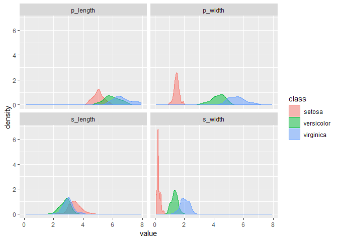

Back to Iris: testing in R
================
Jose Francisco Endrinal

*DISCLAIMER: I am not a working data analyst, nor am I a data scientist. As such, the code, techniques, and methods used in this blog post do not qualify as industry-level code, techniques, and methods. This blog and its corresponding github repository are meant to document my progress as I come to learn the techniques and skills a data analyst or data scientist will be needing in their line of work. This style of learning is popularly called "Learning in Public"*

Introduction
------------

Great data analysis seems to have all the steps carefully checked out and evaluated. And since data analysis is done in code, so it goes that the code we write should be checked out and evaluated. We can manually try to run our R code on the console over and over again, but it becomes really difficult when you have so much code and so much data, models, and functions to test.

Fortunately for us, there are conventions in coding that help us automatically test our code for whatever conditions we want to apply. There is a practice called test-driven programming (TDP) where software engineers write out the tests that their code has to satisfy. Data analysis experts have taken this convention and called it test-driven data analysis (TTDA).

Testing your code has now become an important part of the data analysis process. For one, every step of processing data works under certain assumptions. It's not always the case that those assumptions are true. And when your assumptions are not in check, the steps in your analysis break down.

Another reason to test your code is that models also have the same assumptions. In linear regression alone, there are five major assumptions that you have to keep in order that the results of linear regression to be unbiased. Testing your code ensures that the model fulfills all those assumptions.

There are two testing packages in R `assertthat` and `testthat`. `assertthat` gives modules to test particular functions. These tests help ensure that the code receives the right inputs for the function to work. `testthat` is a package for what are called unit tests, which tests the outputs of certain function for any condition you give it.

Testing is not only good for code functions. It's also good for data and for models. In this [paper](https://ai.google/research/pubs/pub45742) by Google, they show where it is important to test your data analysis pipeline. One of the tests they recommend is to test your data to make sure they are distributed as expected.

We'll be trying to use `testthat` in this post to test whether our variables are normally distributed.

Setup
-----

We load our standard packages which include `tidyverse` and `testthat`. We read in our iris dataset and give it tidy names and recode any weird values.

``` r
# Load packages
suppressPackageStartupMessages({
  library(tidyverse)
  library(testthat)}) # for unit tests
# Load dataset
read_csv("data/iris.csv") %>% 
  # Rename to better variable names
  rename(p_length = X1, 
         s_length = X2, 
         p_width = X3, 
         s_width = X4, 
         class = X5) %>% 
  # Remove `Iris-` from class
  mutate(
    class = recode(class, 
                   "Iris-setosa" = "setosa", 
                   "Iris-versicolor"= "versicolor", 
                   "Iris-virginica" = "virginica")) -> iris.dt
```

First look at the dataset
-------------------------

``` r
# View dataset
iris.dt
```

    ## # A tibble: 150 x 5
    ##    p_length s_length p_width s_width class 
    ##       <dbl>    <dbl>   <dbl>   <dbl> <chr> 
    ##  1      5.1      3.5     1.4     0.2 setosa
    ##  2      4.9      3       1.4     0.2 setosa
    ##  3      4.7      3.2     1.3     0.2 setosa
    ##  4      4.6      3.1     1.5     0.2 setosa
    ##  5      5        3.6     1.4     0.2 setosa
    ##  6      5.4      3.9     1.7     0.4 setosa
    ##  7      4.6      3.4     1.4     0.3 setosa
    ##  8      5        3.4     1.5     0.2 setosa
    ##  9      4.4      2.9     1.4     0.2 setosa
    ## 10      4.9      3.1     1.5     0.1 setosa
    ## # ... with 140 more rows

Same dataset as in a previous [post](https://medium.com/@jgendrinal/exploring-the-iris-dataset-260cc1e5cdf7). The same sort of features.

To give a more visual look at this dataset ...

Exploratory Data Analysis
-------------------------

``` r
# Distribution of the class/target over the variable
gather(iris.dt, key = "measure", value = "value", -class) %>% 
  ggplot(aes(value)) + 
  geom_density(aes(fill = class, 
                   color = class), 
               alpha = 0.5, 
               position = "identity") + 
  facet_wrap(~ measure)
```



Here is the target over the other variables and how they are distributed. They seem to center on different points for each specie of iris, and they seem to be bell-shaped.

Now, let's try testing our dataset for whether each feature for each specie of iris is normally distributed.

Testing our data
----------------

In R, there is a test called the Shapiro test which tries to find out whether the distribution of a set of values is statistically different from a normal distribution. When doing statistical tests, we usually generate a test statistic and convert it into what's called a p-value. Roughly, speaking, this p-value is the probability that there is data less than the data. I won't get into the details here of how to derive the p-value and what it's about, but if you're interested in really really understanding it, I would recommend that you look into [this article](http://daniellakens.blogspot.sg/2017/12/understanding-common-misconceptions.html) and download [this paper](https://link.springer.com/article/10.1007/s10654-016-0149-3).

We invoke this test in R using the command `shapiro.test()` and we use `$p.value` to extract the p-value in this example.

For simplicity's sake, we arbitrarily set the value for "statistically different" to be less than 0.05. This means that if the test returns anything greater than 0.05, we consider it as not statistically different from a normal distribution.

Here's our test code:

``` r
context("Features are normally distributed")

test_that("Petal lengths are normally distributed", {
  filter(iris.dt, class == "setosa")[["p_length"]] %>% 
    shapiro.test(.) -> setosa
  filter(iris.dt, class == "versicolor")[["p_length"]] %>% 
    shapiro.test(.) -> versicolor
  filter(iris.dt, class == "virginica")[["p_length"]] %>% 
    shapiro.test(.) -> virginica
  expect_gt(setosa$p.value, 0.05)
  expect_gt(versicolor$p.value, 0.05)
  expect_gt(virginica$p.value, 0.05)
})
test_that("Petal widths are normally distributed", {
  filter(iris.dt, class == "setosa")[["p_width"]] %>% 
    shapiro.test(.) -> setosa
  filter(iris.dt, class == "versicolor")[["p_width"]] %>% 
    shapiro.test(.) -> versicolor
  filter(iris.dt, class == "virginica")[["p_width"]] %>% 
    shapiro.test(.) -> virginica
  expect_gt(setosa$p.value, 0.05)
  expect_gt(versicolor$p.value, 0.05)
  expect_gt(virginica$p.value, 0.05)
})
test_that("Sepal lengths are normally distributed", {
  filter(iris.dt, class == "setosa")[["s_length"]] %>% 
    shapiro.test(.) -> setosa
  filter(iris.dt, class == "versicolor")[["s_length"]] %>% 
    shapiro.test(.) -> versicolor
  filter(iris.dt, class == "virginica")[["s_length"]] %>% 
    shapiro.test(.) -> virginica
  expect_gt(setosa$p.value, 0.05)
  expect_gt(versicolor$p.value, 0.05)
  expect_gt(virginica$p.value, 0.05)
})
test_that("Sepal widths are normally distributed", {
  filter(iris.dt, class == "setosa")[["s_width"]] %>% 
    shapiro.test(.) -> setosa
  filter(iris.dt, class == "versicolor")[["s_width"]] %>% 
    shapiro.test(.) -> versicolor
  filter(iris.dt, class == "virginica")[["s_width"]] %>% 
    shapiro.test(.) -> virginica
  expect_gt(setosa$p.value, 0.05)
  expect_gt(versicolor$p.value, 0.05)
  expect_gt(virginica$p.value, 0.05)
})
```

    ## Error: Test failed: 'Sepal widths are normally distributed'
    ## * setosa$p.value is not strictly more than 0.05. Difference: -0.05
    ## * versicolor$p.value is not strictly more than 0.05. Difference: -0.0227

We seem to have a problem with sepal lengths from setosa and versicolor. Let's get really close and see what the problem is:

``` r
# Distribution of iris classes over s_widths
gather(iris.dt, key = "measure", value = "value", -class) %>% 
  filter(measure == "s_width") %>% 
  ggplot(aes(value)) + 
  geom_density(aes(fill = class, 
                   color = class), 
               alpha = 0.5, 
               position = "identity")
```


setosa is really chaotic while versicolor has two peaks. Virginica is flatter which makes it more or less more normal.

setosa might be erratic because it is the closest to zero. Let's filter out setosa and get the summary statistics.

``` r
filter(iris.dt, class %in% c("setosa")) %>% 
  select(s_width) %>% 
  summary
```

    ##     s_width     
    ##  Min.   :0.100  
    ##  1st Qu.:0.200  
    ##  Median :0.200  
    ##  Mean   :0.244  
    ##  3rd Qu.:0.300  
    ##  Max.   :0.600

``` r
filter(iris.dt, class %in% c("versicolor")) %>% 
  select(s_width) %>% 
  summary
```

    ##     s_width     
    ##  Min.   :1.000  
    ##  1st Qu.:1.200  
    ##  Median :1.300  
    ##  Mean   :1.326  
    ##  3rd Qu.:1.500  
    ##  Max.   :1.800

We have to smoothen this dataset so we can make a fair model out of it. But that can be a post for another time.

------------------------------------------------------------------------

More dataset information: [\[Dataset description\]](link%20to%20website)

Feedback:
Email: <francis.endrinal@gmail.com>
FB Messenger: m.me/transparencyman
Twitter, Instagram: @jgendrinal
