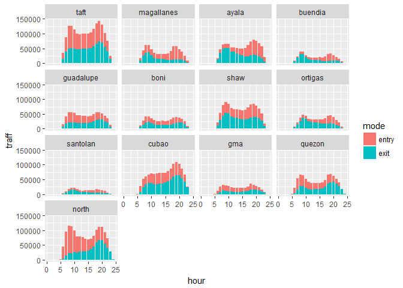
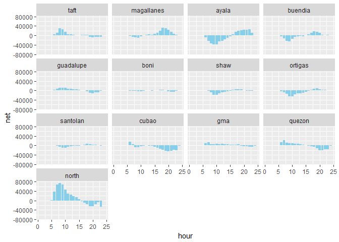
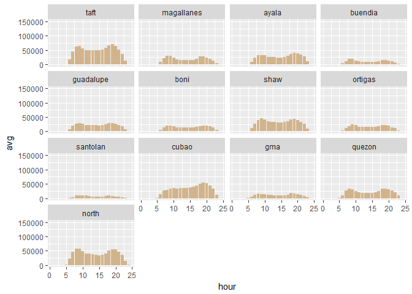
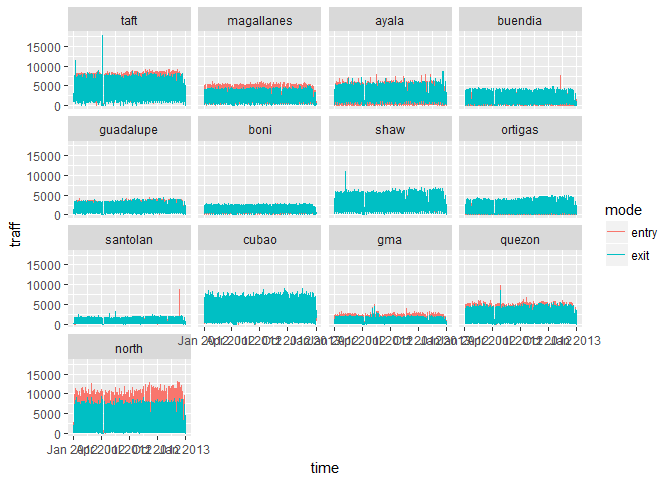
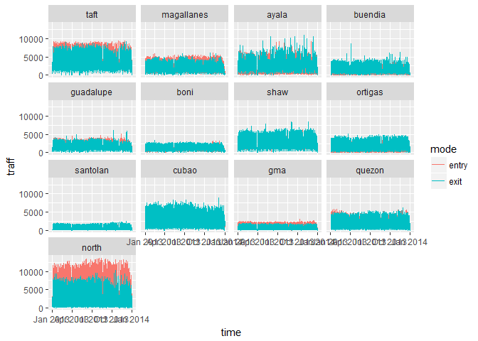
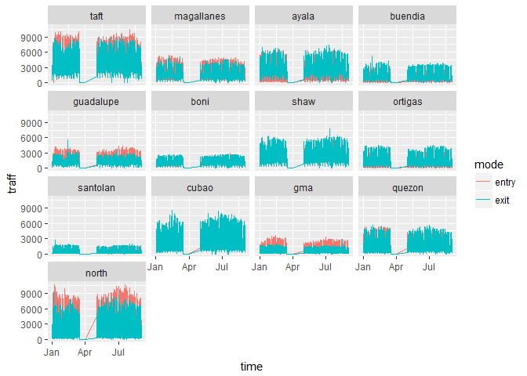
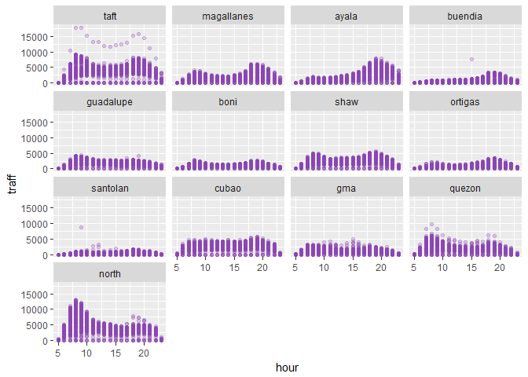
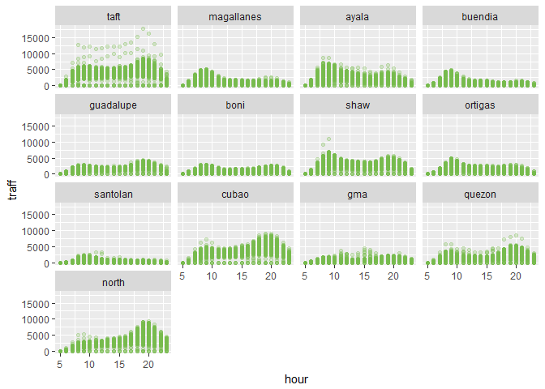

The MRT dataset: A Case in Exploratory Data Analysis
================
Jose Francisco Endrinal

The Metro Rail Transit (MRT) is a light rail transit system in Metro Manila, Philippines that runs along Epifanio delos Santos Avenue (EDSA) from Taft Avenue Station in Manila, to North Avenue Station in Quezon City. This dataset is the hourly traffic of passengers going in and out of turnstiles at the different train stations covering the years 2012 to 2014.

I cleaned up this dataset before I put it here so that we can do exploratory data analysis (EDA) straightaway. For the source code on how this was cleaned up, you can check out the link [here](R/wrang.R).

I'm not going to draw any insights from this dataset. I am simply going to decompose this dataset so I can figure out what to do with it later.

Let's get started!

Setup
-----

``` r
# Load packages
suppressPackageStartupMessages({
  library(tidyverse)
  library(lubridate)})
# Load dataset
read_csv("data/clean/mrttraff.csv") %>% 
  mutate(
    station = parse_factor(station, 
               c("taft", 
                 "magallanes", 
                 "ayala", 
                 "buendia", 
                 "guadalupe", 
                 "boni", 
                 "shaw", 
                 "ortigas", 
                 "santolan", 
                 "cubao", 
                 "gma", 
                 "quezon", 
                 "north"), 
               ordered = TRUE)) -> mrt.dt
```

First look at the dataset
-------------------------

``` r
# View dataset
mrt.dt
```

    ## # A tibble: 294,528 x 8
    ##     year month   day station  hour entry  exit   net
    ##    <int> <int> <int> <ord>   <int> <int> <int> <int>
    ##  1  2012     1     1 ayala       1     0     0     0
    ##  2  2012     1     1 ayala       2     0     0     0
    ##  3  2012     1     1 ayala       3     0     0     0
    ##  4  2012     1     1 ayala       4     0     0     0
    ##  5  2012     1     1 ayala       5     0     0     0
    ##  6  2012     1     1 ayala       6     0     0     0
    ##  7  2012     1     1 ayala       7     0     0     0
    ##  8  2012     1     1 ayala       8   296   310   -14
    ##  9  2012     1     1 ayala       9   229   367  -138
    ## 10  2012     1     1 ayala      10   253   577  -324
    ## # ... with 294,518 more rows

This dataset shows the `year`, `month`, `day`, `station`, `hour`, as well as the number of people who have entered the station (`enter`) and who have exited (`exit`) as well the `net` entry/exit (+/-).

This dataset features all the stations of the MRT covering 24 hours.

``` r
unique(mrt.dt$station)
```

    ##  [1] ayala      boni       buendia    cubao      gma        guadalupe 
    ##  [7] magallanes north      ortigas    quezon     santolan   shaw      
    ## [13] taft      
    ## 13 Levels: taft < magallanes < ayala < buendia < guadalupe < ... < north

``` r
unique(mrt.dt$hour)
```

    ##  [1]  1  2  3  4  5  6  7  8  9 10 11 12 13 14 15 16 17 18 19 20 21 22 23
    ## [24] 24

Looking at the averages for traffic `entry`, `exit`, and `net` overall, we have the following:

``` r
summary(select(mrt.dt, entry, exit, net))
```

    ##      entry            exit            net          
    ##  Min.   :    0   Min.   :    0   Min.   :-9758.00  
    ##  1st Qu.:    2   1st Qu.:    0   1st Qu.: -284.00  
    ##  Median : 1044   Median : 1071   Median :    0.00  
    ##  Mean   : 1512   Mean   : 1494   Mean   :   18.04  
    ##  3rd Qu.: 2347   3rd Qu.: 2304   3rd Qu.:  272.00  
    ##  Max.   :17779   Max.   :17801   Max.   :11857.00

Our five number summaries give us the above.

Exploratory Data Analysis
-------------------------

``` r
# Distribution of the class/target over the variable
select(mrt.dt, month, hour, station, entry, exit) %>% 
  gather(key = "mode", value = "traff", entry, exit) %>% 
  group_by(station, month, hour, mode) %>% 
  summarise(traff = mean(traff)) %>% 
  ungroup() %>% 
  ggplot(aes(x = hour, y = traff)) + 
    geom_bar(aes(fill = mode), 
             stat = "identity", 
             position = "stack") + 
    facet_wrap(~ station)
```



``` r
select(mrt.dt, month, hour, station, net) %>% 
  group_by(station, month, hour) %>% 
  summarise(net = mean(net)) %>% 
  ungroup() %>% 
  ggplot(aes(x = hour, y = net)) + 
  geom_bar(stat = "identity", 
           fill = "skyblue") + 
  ylim(-75000, 75000) + 
  facet_wrap(~ station)
```



``` r
select(mrt.dt, month, hour, station, entry, exit) %>% 
  mutate(avg = (entry + exit)/2) %>% 
  select (-entry, -exit) %>% 
  group_by(station, month, hour) %>% 
  summarise(avg = mean(avg)) %>% 
  ungroup() %>% 
  ggplot(aes(x = hour, y = avg)) + 
  geom_bar(stat = "identity", 
           position = "stack", 
           fill = "tan") + 
  ylim(0, 150000) + 
  facet_wrap(~ station)
```



Let's try and see the trends for entry and exit per station. Let's try 2012 first

``` r
# Function to take the year and plot the station trends for that year
take_year <- function(year_){
  select(mrt.dt, -net) %>% 
  filter(year == year_ & hour > 5 & hour < 22) %>% 
  mutate(month = if_else(month < 10, str_c("0", month), as.character(month)), 
         day = if_else(day < 10, str_c("0", day), as.character(day)), 
         hour = if_else(hour < 10, str_c("0", hour), as.character(hour)), 
         time = str_c(as.character(year), month, day, hour) %>% ymd_h) %>% 
  select(-year, -month, -day, -hour) %>% 
  gather(key = "mode", value = "traff", entry, exit) %>% 
  ggplot(aes(time)) + 
  geom_line(aes(y = traff, color = mode)) + 
  facet_wrap(~station)
}
```

``` r
take_year(2012)
```



Mostly even.

``` r
take_year(2013)
```



``` r
take_year(2014)
```



Notice that we have missing data for some periods. Will investigate at another time why this is the case.

``` r
select(mrt.dt, year, station, hour, entry, exit) %>% 
  gather(key = "mode", value = "traff", entry, exit) %>% 
  filter(mode == "entry") %>% 
  filter(year == 2012) %>% 
  filter(hour > 4 & hour < 24) %>% 
  ggplot(aes(hour, traff)) + 
  geom_point(color = "#8A45B3", alpha = 0.25) + 
  facet_wrap(~station)
```



``` r
select(mrt.dt, year, station, hour, entry, exit) %>% 
  gather(key = "mode", value = "traff", entry, exit) %>% 
  filter(mode == "exit") %>% 
  filter(year == 2012) %>% 
  filter(hour > 4 & hour < 24) %>% 
  ggplot(aes(hour, traff)) + 
  geom_point(color = "#76BA4C", alpha = 0.25) + 
  facet_wrap(~station)
```



Would be interesting to check the distribution of traffic per hour per station.

------------------------------------------------------------------------

More dataset information: [MRT Daily dataset](https://www.gov.ph/data/dataset/metro-rail-transit-line-3-passenger-traffic-daily)

Feedback:
Email: <francis.endrinal@gmail.com>
FB Messenger: m.me/transparencyman
Twitter, Instagram: @jgendrinal
