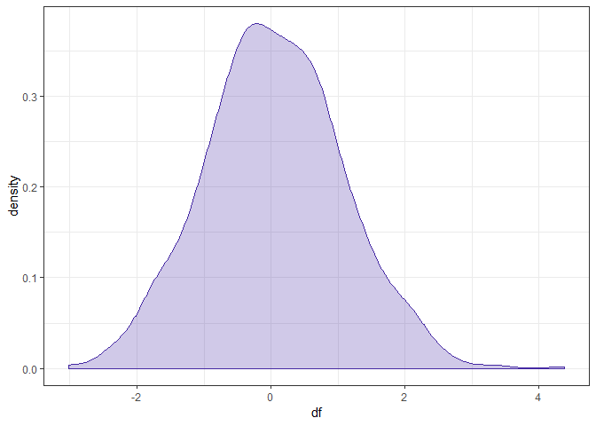
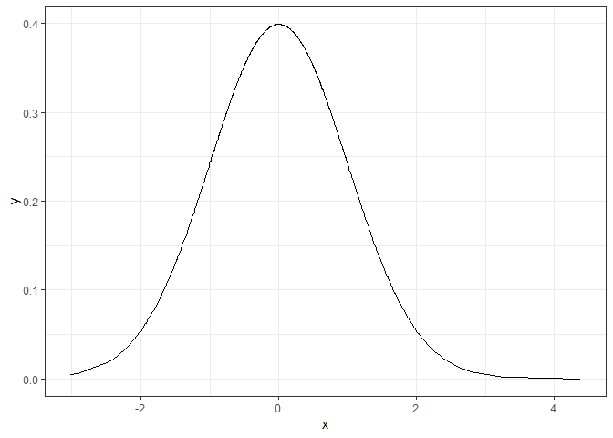
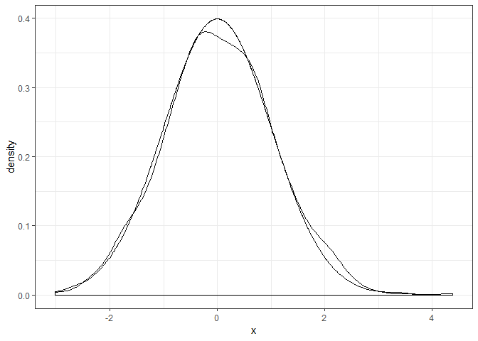

SundayStats: A deep dive into the stats package in R - The Normal Distribution
==============================================================================
================
Jose Francisco Endrinal

*DISCLAIMER: I am not a working data analyst, nor am I a data scientist. As such, the code, techniques, and methods used in this blog post do not qualify as industry-level code, techniques, and methods. This blog and its corresponding github repository are meant to document my progress as I come to learn the techniques and skills a data analyst or data scientist will be needing in their line of work. This style of learning is popularly called "Learning in Public"*

Introduction
------------

*\#SundayStats is a weekly post on this blog about the default `stats` package in R. Each week (usually when I feel like it), I will be working with one function/group of functions in this package and will talk about how to use it in a practical setting.*

If you've taken a statistics class, you probably know about some fancy concept called the normal distribution. If you're like most people and myself, you would have forgetten its importance the second you graduate from university. While most fields are doing statistical analysis as a way to test their claims about the world, the backbone of most of that analysis is often misunderstood or taken for granted. Yes, the normal distribution underpins most if not all scientific and social science quantitatively-backed study, including useful tools such as linear regression, hypothesis testing, and the like. And yet most of us do statistical work blissfuly unaware of its properties and the role they play in our analysis.

This blog post will try to help in the reader's understanding of the normal distribution by demonstrating how it's used in the R `stats` package. I won't pretend this will be an exhaustive blog post, but it will broadly cover the concept enough to help the reader grasp its characteristics and understand its use in statistical analysis.

But first, if there is such a thing a normal distribution. What is a distribution in the first place?

As a quick review, you know that when you want to understand how typically long, how typically short, how typically many or how few of a thing in the world is, you collect enough data and begin to realize that quantities/dimensions of things tend to not just be fixed at one value. What you'll find is that the measurements usually center around a number somewhere, and that generally, the measures/counts will spread a certain way.

A distribution is a model that describes how frequently countable increasing/decreasing numbers would occur given that your randomly sampled data gets very large (massive oversimplification here, trying to talk to a general audience). Put simply, it is a claim about whether the data is centered or spread a certain way and and attempt to quantify how much.

Now a normal distribution is a special distribution where most of the values are near a "center" and fewer of the values are farther away from the center. Now a lot of other types of distributions can have this characteristic, but most people would be happy with saying that something is normally distributed. You can argue about whether some other distribution better represents the data on hand. But because the normal distribution is more familiar to work with from a statistical standpoint, people tend to use it.

Let's take a deep dive.

``` r
suppressPackageStartupMessages({
  library(tidyverse)})
```

The function definition of the normal distribution
--------------------------------------------------

Here is the probability density function for the normal distribution:

}^2}{2\sigma^2}}")

And here it is in R code:

``` r
norm_dist <- function(x, mu, sigma) {
  coef = 1/(sigma*sqrt(2*pi))
  power =-((x - mu)**2)/(2*sigma**2)
  return(coef*exp(power))
}
```

The function you saw above is what's called a probability density function. What this means is that this is simply a mathematical formula putting together our assumptions about how our data is centered and spread.

I thought about breaking the formula down so that everyone understands the concepts. But then I realized that I would have to delve into more elementary mathematics - something we do not have time for. This is the subject for another blog post (maybe).

The best I can do it graph this function so you can see what it's shaped like.

``` r
data_frame(x = seq(-5, 5, 0.01), 
           y = norm_dist(x, 0, 1)) %>% 
  ggplot(aes(x, y)) + 
  geom_line() + 
  theme_bw()
```


And there it is.

Why may you ask is it shaped like that? The goal of the normal distribution is to approximate data that is typically centered around one value and typically has less values as you go farther away from the center. Assume for the moment that the graph represents a plot of x being the value you are measuring, and y being something that estimates how frequently the value or similar values might be present.

In the image above, the distribution is centered at 0. The mean of the deviations is 1. And as you get further and further away from 0, you'll find they are less and less likely.

Now that you more or less have a grasp of the normal distribution, let's see how R implements it.

Using rnorm() to generate a normally distributed dataset
--------------------------------------------------------

R can generate data that follows the normal distribution given the mean (`mean`) and the standard deviation (`sd`) \[how typically far away from the center the values usually are\].

The `rnorm()` function generates random values. More of these values will be closer to the mean, and the further away from the mean, the less likely `rnorm()` is going to generate that value.

``` r
# Generate dataset
set.seed(2387) # for reproducibility
df <- rnorm(n = 1000, mean = 0, sd = 1)
```

Let's see what df looks like.

``` r
df[1:20]
```

    ##  [1] -2.24195119 -0.15248452 -1.02637909 -1.34431089  0.83206678
    ##  [6] -0.54800567  1.17524440  2.10185227 -0.03451892  1.16019327
    ## [11] -0.93559119  0.07057199  1.62092549  1.76834554  0.06896674
    ## [16]  0.51217562 -1.08950799 -1.29309982  0.40148358  0.26479060

So far so good. But if you're keen enough to notice. It will be hard to count the relative frequency of the values now, given that they never overlap. `ggplot`'s `geom_density` takes care of this by estimating the relative frequency, by looking at how close the values are to each other. The closer they are to each other, the more likely a value nearby will occur. Let's plot df using the `geom_density` feature:

``` r
ggplot(data_frame(df = df), aes(df)) + 
  geom_density(fill = "#4529A3", color = "#4529A3", alpha = 0.25) + 
  theme_bw()
```



Not quite like the previous graph where it's perfectly the same. But randomly generated data will never be quite as perfect as the mathematical version shown above.

Anyways, this is somewhat normal. Good enough.

So now, you know how to generate your own normally distributed values. How about when you only have the values, and you want to get their pdf values (the `y`'s in the equation earlier)?

Using dnorm() to get the value corresponding density
----------------------------------------------------

``` r
# show function/s with all their attributes
df2 <- dnorm(df, mean = 0, sd = 1)
```

``` r
# Visualize/print output
df2[1:20]
```

    ##  [1] 0.03231864 0.39433113 0.23558923 0.16161725 0.28220935 0.34331955
    ##  [7] 0.19997994 0.04381277 0.39870467 0.20352575 0.25753389 0.39795007
    ## [13] 0.10724512 0.08353735 0.39799464 0.34990259 0.22036889 0.17290861
    ## [19] 0.36805126 0.38519886

Here's what it looks like:

``` r
data_frame(x = df, 
           y = df2) %>% 
  ggplot(aes(x,y)) + 
  geom_line() + 
  theme_bw()
```



If you're real clever, you'll notice that this is almost the same as the `norm_dist()` function we made.

We can actually overlap the two distributions. It turns out they are not as far away as I previously thought.

``` r
data_frame(x = df, 
           y = df2) %>% 
  ggplot(aes(x)) + 
  geom_density() + 
  geom_line(aes(y=y)) + 
  theme_bw()
```



Hopefully, I didn't do too bad a job of showing how the norm functions work in R! Let me know how I can improve in this post.

Hope everyone enjoys the New Year!

------------------------------------------------------------------------

If you liked this blog post, feel free to give me a clap!

If you'd like to give feedback, you can reach out to me at:
Email: <livingwithdata@gmail.com>
Twitter: @livingwithdata
