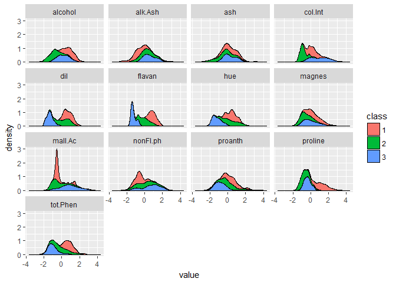
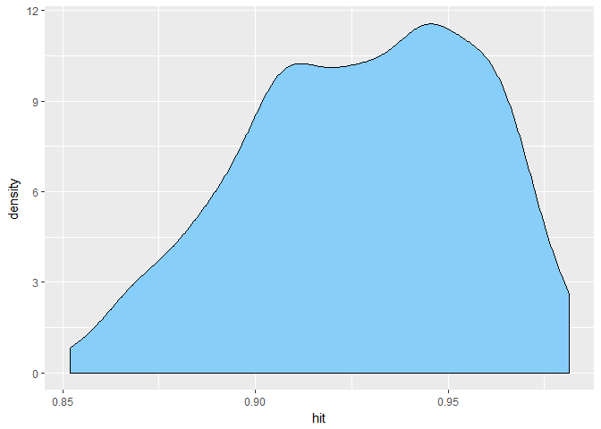

Wasted on data: Exploring the wine dataset
================
Jose Francisco Endrinal

Whether you're a drinker or not, chances are that alcohol has played some part in the culture of where you live. It would be awesome to take measurements on any wine and be able to determine what kind of wine it was. In this dataset, we're sticking with three unidentified types of wine.

The wine dataset is a series of measurements of different samples of three types of wine. In this dataset, there are thirteen characteristics that were measured: 1. Alcohol 2. Malic acid 3. Ash 4. Alcalinity of ash
5. Magnesium 6. Total phenols 7. Flavanoids 8. Nonflavanoid phenols 9. Proanthocyanins 10. Color intensity 11. Hue 12. OD280/OD315 of diluted wines 13. Proline

Unfortunately, we do not have the units of these measurements and simply have to rely on their relative values.

``` r
# Loading package
suppressPackageStartupMessages({
  library(nnet)
  library(tidyverse)
  library(modelr)})
#Loading dataset
read_csv("data/wine.csv") %>% 
  rename(class = X1, 
         alcohol = X2, 
         mall.Ac = X3, 
         ash = X4, 
         alk.Ash = X5, 
         magnes = X6, 
         tot.Phen = X7, 
         flavan = X8, 
         nonFl.ph = X9, 
         proanth = X10, 
         col.Int = X11, 
         hue = X12, 
         dil = X13, 
         proline = X14) -> wine
```

    ## # A tibble: 178 x 14
    ##    class alcohol mall.Ac   ash alk.Ash magnes tot.Phen flavan nonFl.ph
    ##    <int>   <dbl>   <dbl> <dbl>   <dbl>  <int>    <dbl>  <dbl>    <dbl>
    ##  1     1    14.2    1.71  2.43    15.6    127     2.80   3.06    0.280
    ##  2     1    13.2    1.78  2.14    11.2    100     2.65   2.76    0.260
    ##  3     1    13.2    2.36  2.67    18.6    101     2.80   3.24    0.300
    ##  4     1    14.4    1.95  2.50    16.8    113     3.85   3.49    0.240
    ##  5     1    13.2    2.59  2.87    21.0    118     2.80   2.69    0.390
    ##  6     1    14.2    1.76  2.45    15.2    112     3.27   3.39    0.340
    ##  7     1    14.4    1.87  2.45    14.6     96     2.50   2.52    0.300
    ##  8     1    14.1    2.15  2.61    17.6    121     2.60   2.51    0.310
    ##  9     1    14.8    1.64  2.17    14.0     97     2.80   2.98    0.290
    ## 10     1    13.9    1.35  2.27    16.0     98     2.98   3.15    0.220
    ## # ... with 168 more rows, and 5 more variables: proanth <dbl>, col.Int
    ## #   <dbl>, hue <dbl>, dil <dbl>, proline <int>

Looking at the dataset alone, we can see that most of these variables are continuous. But we have too many characteristics to work with, hurting the insight we could gain. Let's try to do what we did last time with our [breast cancer dataset](../breastcancer/breastcancer_post1.md). We need to see if there may be an apparent way to separate the classes and the characteristics based on visualization alone.

### Exploratory data analysis

Let's see which variables we can use to divide the data classes. Unlike our previous post on the breast cancer dataset, this data is continuous data. Which means that we need to look at the smoothened distribution rather than the discrete occurences.

Our visualization looks like the following:

``` r
mutate(wine, class = as.character(class)) %>% 
  mutate_if(is.numeric, scale) %>% # change to z-scores
  gather(key, value, -class) %>% 
  ggplot(aes(x = value)) + 
  geom_density(aes(fill = class), position = "stack") + 
  facet_wrap(~ key, ncol = 4)
```



dil, hue and tot.Phen here look like they can divide the red and blue class well. col.Int has the green and blue class on either side. proline differentiates the red and green class well. I'll try and think of a deliberate way to pick variables in this post, by this is the best I have so far. In the future, I'll be using feature selection methods that don't require expert judgement (filter, wrapper methods, etc.) and instead rely on statistical methods to weed out variables.

Using these variables, we'd like to know if a k-means model would work in separating these three classes well and how well we can improve it.

Training and Testing Sets
-------------------------

Like in our previous post, let us make 100 training and testing sets for our dataset.

``` r
set.seed(2387)
tt.sets <- select(wine, 
                  class, 
                  dil, 
                  hue, 
                  tot.Phen, 
                  col.Int, 
                  proline) %>% 
  mutate(class = as.character(class) %>% as_factor) %>% 
  crossv_mc(n = 100, test = 0.3) %>% 
  mutate(ind.tr = map(train, as.integer), 
         ind.te = map(test, as.integer), 
         train.s = map(train, as_data_frame), 
         test.s = map(test, as_data_frame))
```

``` r
tt.sets
```

    ## # A tibble: 100 x 7
    ##    train          test           .id   ind.tr      ind.te  train.s  test.s
    ##    <list>         <list>         <chr> <list>      <list>  <list>   <list>
    ##  1 <S3: resample> <S3: resample> 001   <int [124]> <int [~ <tibble~ <tibb~
    ##  2 <S3: resample> <S3: resample> 002   <int [124]> <int [~ <tibble~ <tibb~
    ##  3 <S3: resample> <S3: resample> 003   <int [124]> <int [~ <tibble~ <tibb~
    ##  4 <S3: resample> <S3: resample> 004   <int [124]> <int [~ <tibble~ <tibb~
    ##  5 <S3: resample> <S3: resample> 005   <int [124]> <int [~ <tibble~ <tibb~
    ##  6 <S3: resample> <S3: resample> 006   <int [124]> <int [~ <tibble~ <tibb~
    ##  7 <S3: resample> <S3: resample> 007   <int [124]> <int [~ <tibble~ <tibb~
    ##  8 <S3: resample> <S3: resample> 008   <int [124]> <int [~ <tibble~ <tibb~
    ##  9 <S3: resample> <S3: resample> 009   <int [124]> <int [~ <tibble~ <tibb~
    ## 10 <S3: resample> <S3: resample> 010   <int [124]> <int [~ <tibble~ <tibb~
    ## # ... with 90 more rows

Now that we have the train and test sets, we can build our multinomial logistic regression model using the `nnet` package.

Building the multinomial regression model
-----------------------------------------

We will structure the function we will use to map the training sets so that the output of this function is a model. What makes this model different from the normal logistic regression model is that this model is for a class where the values are not 1 or 0. In this case, the values can be 1, 2, or 3.

``` r
mnom <- function(df){
  multinom(class ~ 
             dil + 
             hue + 
             tot.Phen + 
             col.Int + 
             proline, 
           data = df, 
           trace = FALSE)}
```

We have enabled `trace` to be `FALSE` so that no messages will display.

Now for the predicting and response functions:

``` r
mnom_predict <- function(model, df){
  preds <- predict(model, newdata = select(df, -class), type = "class")}
mnom_response <- function(df){
  df[["class"]]}
```

Training and testing the model
------------------------------

As in the same way we did it in my previous post, our recipe for training and testing our model will be done in the following way.

``` r
# average score
mnom_mscore <- function(pred, resp){
  df <- pred == resp
  mean(df)}
# create new variables
tt.sets <- tt.sets %>% 
  mutate(model = map(train.s, mnom), 
         pred = map2(model, test.s, mnom_predict), 
         resp = map(test.s, mnom_response), 
         hit = map2_dbl(pred, resp, mnom_mscore))
score <- summarise(tt.sets, score = mean(hit))
score[[1]]
```

    ## [1] 0.9275926

With an accuraccy of about ~93 percent, this model can still do better, but this is a great starting point for it.

Distribution of scores
----------------------

Let's see how densely the scores are together so that we can see how likely it is to have another score other than our ~93 percent average.

``` r
select(tt.sets, hit) %>% 
  ggplot(aes(x = hit)) + 
  geom_density(fill = "#87CEFA")
```



The distribution is not gaussian, but more scores ten toward a ~95 percent accuracy on the part of this model.

Visualizing the effect of a multinomial regression
--------------------------------------------------

We visualize the effect of two variables on the regression and see if a clear joint relationship can be seen with regard to separation.

``` r
select(wine, 
       class, 
       dil, 
       hue, 
       tot.Phen, 
       col.Int, 
       proline) %>% 
  mutate(
    dil = scale(dil), 
    hue = scale(hue), 
    tot.Phen = scale(tot.Phen), 
    col.Int = scale(col.Int), 
    proline = scale(proline))
```
